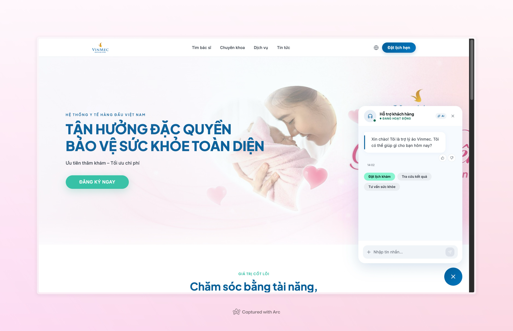

# VinmecPrep AI

VinmecPrep AI is a multi-module healthcare assistant project that helps patients prepare before visiting Vinmec. The system focuses on pre-visit guidance such as fasting requirements, required documents, booking recommendations, expected arrival time, and branch lookup.


## Table of Contents

- [1. Project Overview](#1-project-overview)
- [2. Repository Structure](#2-repository-structure)
- [3. Architecture](#3-architecture)
- [4. Main Features](#4-main-features)
- [5. Tech Stack](#5-tech-stack)
- [6. Quick Start](#6-quick-start)
- [7. Environment Configuration](#7-environment-configuration)
- [8. Running the Backend Stack](#8-running-the-backend-stack)
- [9. Running the Web Frontend](#9-running-the-web-frontend)
- [10. Running the Mobile App](#10-running-the-mobile-app)
- [11. API Summary](#11-api-summary)
- [12. Data Ingestion and Retrieval](#12-data-ingestion-and-retrieval)
- [13. Available Documents](#13-available-documents)
- [14. Team](#14-team)

## 1. Project Overview

This repository contains a complete prototype for an AI-powered Vinmec assistant:

- A Python/FastAPI backend for chat APIs, feedback APIs, queue-based processing, and RAG.
- A React/Vite web frontend with landing page sections and an embedded chat widget.
- An Expo-based mobile interface that connects to the same chat backend.
- Docker-based infrastructure for Redis, Kafka, Weaviate, and SearXNG.

The assistant is designed to answer narrow, operational healthcare questions safely, instead of acting like a general medical diagnosis bot.


## 2. Repository Structure

```text
.
|-- backend/              # FastAPI app, Kafka workers, RAG, tools, Docker stack
|-- frontend/             # React + Vite web app
|-- mobile/               # Expo / React Native mobile app
|-- docker-compose.yml    # Simple root compose for backend + frontend
|-- spec-final.md         # Product/specification document
|-- demo-slides.pdf       # Demo presentation
|-- AI_Product_Canvas     # Product canvas notes
`-- README.md             # This file
```

### Important note

There are two Docker Compose entry points:

- `docker-compose.yml` at the repository root: a simpler setup for backend + frontend only.
- `backend/docker-compose.yml`: the full backend infrastructure stack with Redis, Kafka, Weaviate, SearXNG, API, and consumer workers.


## 3. Architecture


High-level request flow:

1. User sends a message from web or mobile UI.
2. Frontend calls the FastAPI `/chat` endpoint.
3. API server creates a `job_id` and pushes the chat job to Kafka.
4. Kafka consumer workers process the request asynchronously.
5. The agent runs guardrails, LangGraph orchestration, RAG search, optional web search, and branch lookup tools.
6. The result is written to Redis.
7. API polls Redis and returns the final reply to the client.
8. Optional user feedback is stored for later analysis.


```text
Web / Mobile
    -> FastAPI API
    -> Kafka job queue
    -> Consumer workers
    -> LangGraph agent + tools
    -> Redis result cache
    -> API response
```

## 4. Main Features

**English**

- Personalized pre-visit checklist generation.
- Guidance about fasting, documents, booking, and expected timing.
- Vinmec branch lookup and hospital finder support.
- Retrieval-augmented answers from curated medical preparation data.
- Optional web-search fallback for missing or weak retrieval results.
- Guardrails for blocking out-of-scope or unsafe requests.
- Per-turn feedback and end-of-session rating APIs.
- Trainer-protected analytics endpoints for feedback review.


## 5. Tech Stack

### Backend

- Python 3.11
- FastAPI
- Uvicorn
- LangChain / LangGraph
- LiteLLM
- Redis
- Kafka
- Weaviate
- SearXNG
- Sentence Transformers or OpenAI embeddings

### Frontend

- React 19
- Vite
- Tailwind CSS 4
- Lucide React

### Mobile

- Expo
- React Native
- Axios

### Infrastructure

- Docker
- Docker Compose
- Nginx

## 6. Quick Start

Choose one of these paths:

- If you want the full AI backend with queueing, vector DB, and search services, use `backend/docker-compose.yml`.
- If you only want to build the basic backend + frontend containers from the repo root, use the root `docker-compose.yml`.
- If you want frontend-only or mobile-only local development, run those modules separately.


## 7. Environment Configuration

### Backend environment

The backend reads configuration from environment variables through [`backend/src/config.py`](/D:/Vinno/Nhom26-E403-Day06/backend/src/config.py).

Common variables used by the backend:

```env
LLM_MODEL=groq/qwen/qwen3-32b
LLM_API_KEY=your_key_here
LLM_API_BASE=

REDIS_URL=redis://:your_redis_password@redis:6379/0
WEAVIATE_URL=http://weaviate:8080
SEARXNG_URL=http://searxng:8080

TRAINER_API_KEY=your_trainer_key
ALLOWED_ORIGINS=http://localhost:3000,http://localhost:8890
RATE_LIMIT_RPM=20
```

Notes:

- `LLM_API_KEY` may also fall back to `GROQ_API_KEY`.
- The backend can use local embeddings or OpenAI embeddings, depending on your configuration.
- `ALLOWED_ORIGINS` should be a comma-separated list.

### Frontend environment

The web frontend defaults to a hosted API URL in [`frontend/src/lib/chatApi.js`](/D:/Vinno/Nhom26-E403-Day06/frontend/src/lib/chatApi.js). For local development, create `frontend/.env.local`:

```env
VITE_API_URL=http://localhost:6666
```

### Mobile environment

The mobile app loads `CHAT_ENDPOINT` from `mobile/.env` through `react-native-dotenv`.

Example:

```env
CHAT_ENDPOINT=http://localhost:6666/chat
```

If you expose your local app through a tunnel, use that public URL instead.

## 8. Running the Backend Stack

### Option A: Full backend stack

Use [`backend/docker-compose.yml`](/D:/Vinno/Nhom26-E403-Day06/backend/docker-compose.yml) for the complete system.

```bash
cd backend
docker compose up -d --build
```

This stack includes:

- `redis`
- `kafka`
- `kafka-init`
- `weaviate`
- `searxng`
- `api`
- `consumer`

Default exposed ports from the full backend stack:

- `6666` -> FastAPI API
- `8079` -> Weaviate REST
- `50051` -> Weaviate gRPC

Health check:

```bash
curl http://localhost:6666/health
```

Expected response:

```json
{
  "status": "ok",
  "redis": true
}
```

### Option B: Simple root stack

Use the root [`docker-compose.yml`](/D:/Vinno/Nhom26-E403-Day06/docker-compose.yml) if you only want to build:

- `my-backend`
- `my-frontend`

```bash
docker compose up -d --build
```

This simpler setup expects:

- `backend/.env`
- `frontend/.env.local`

Default ports:

- `5000` -> backend container
- `8080` -> frontend container

## 9. Running the Web Frontend

From the `frontend` directory:

```bash
cd frontend
npm install
npm run dev
```

Useful scripts from [`frontend/package.json`](/D:/Vinno/Nhom26-E403-Day06/frontend/package.json):

- `npm run dev`
- `npm run build`
- `npm run lint`
- `npm run preview`

The web UI contains:

- Landing page sections such as hero, features, awards, and facilities.
- An embedded chat widget that sends messages to the backend `/chat` API.

Main entry files:

- [`frontend/src/App.jsx`](/D:/Vinno/Nhom26-E403-Day06/frontend/src/App.jsx)
- [`frontend/src/components/ChatWidget.jsx`](/D:/Vinno/Nhom26-E403-Day06/frontend/src/components/ChatWidget.jsx)
- [`frontend/src/lib/chatApi.js`](/D:/Vinno/Nhom26-E403-Day06/frontend/src/lib/chatApi.js)

## 10. Running the Mobile App

From the `mobile` directory:

```bash
cd mobile
npm install
npx expo start --web
```

Useful scripts from [`mobile/package.json`](/D:/Vinno/Nhom26-E403-Day06/mobile/package.json):

- `npm run start`
- `npm run android`
- `npm run ios`
- `npm run web`

Main mobile entry:

- [`mobile/App.js`](/D:/Vinno/Nhom26-E403-Day06/mobile/App.js)

The mobile UI includes:

- Vinmec-branded header and banner sections.
- A chat card with quick replies.
- API integration through `CHAT_ENDPOINT`.

For public sharing during demos, the repository also documents an `ngrok` workflow in [`mobile/README.md`](/D:/Vinno/Nhom26-E403-Day06/mobile/README.md).

## 11. API Summary

The main API server is implemented in [`backend/src/api/server.py`](/D:/Vinno/Nhom26-E403-Day06/backend/src/api/server.py).

### Public endpoints

- `GET /health`
- `POST /chat`
- `POST /chat/async`
- `GET /chat/result/{job_id}`
- `POST /feedback`
- `POST /feedback/end`

### Trainer-protected endpoints

These require the header:

```http
X-Trainer-Key: <TRAINER_API_KEY>
```

Protected endpoints:

- `GET /feedback`
- `GET /feedback/search`
- `GET /feedback/stats`
- `GET /feedback/end`
- `GET /feedback/end/stats`

### Example chat request

```json
{
  "message": "Xet nghiem mau tong quat can nhin an khong?",
  "session_id": "",
  "history": []
}
```

### Example chat response

```json
{
  "reply": "...",
  "session_id": "8935cba4-9721-4d0f-a2e6-df0a256bd7ae",
  "job_id": "7e7cf996-dfce-4289-b491-f10242ffad8b",
  "blocked": false,
  "guard_result": "pass"
}
```

For a more detailed API usage guide, see [`backend/README_API.md`](/D:/Vinno/Nhom26-E403-Day06/backend/README_API.md).

## 12. Data Ingestion and Retrieval

The repository includes an ingestion script for loading Vinmec preparation data into Weaviate:

- [`backend/scripts/ingest_medical_data.py`](/D:/Vinno/Nhom26-E403-Day06/backend/scripts/ingest_medical_data.py)

Common commands:

```bash
cd backend
python scripts/ingest_medical_data.py
python scripts/ingest_medical_data.py --reset
python scripts/ingest_medical_data.py --verify
python scripts/ingest_medical_data.py --info
```

The RAG-related code lives mainly in:

- [`backend/src/rag`](/D:/Vinno/Nhom26-E403-Day06/backend/src/rag)
- [`backend/src/tools/vinmec_rag.py`](/D:/Vinno/Nhom26-E403-Day06/backend/src/tools/vinmec_rag.py)
- [`backend/src/agent/vinmec_agent.py`](/D:/Vinno/Nhom26-E403-Day06/backend/src/agent/vinmec_agent.py)

## 13. Available Documents

Additional project documents in this repository:

- Product specification: [`spec-final.md`](/D:/Vinno/Nhom26-E403-Day06/spec-final.md)
- Backend API guide: [`backend/README_API.md`](/D:/Vinno/Nhom26-E403-Day06/backend/README_API.md)
- Frontend notes: [`frontend/README.md`](/D:/Vinno/Nhom26-E403-Day06/frontend/README.md)
- Mobile setup guide: [`mobile/README.md`](/D:/Vinno/Nhom26-E403-Day06/mobile/README.md)
- Demo slides: [`demo-slides.pdf`](/D:/Vinno/Nhom26-E403-Day06/demo-slides.pdf)
- Product canvas: [`AI_Product_Canvas`](/D:/Vinno/Nhom26-E403-Day06/AI_Product_Canvas)

## 14. Team

Group members:

1. Duong Trinh Hoai An 
2. Nguyen Manh Quyen 
3. Nguyen Tien Dat 
4. Vu Quang Dung 
5. Tran Ngoc Hung 

---

If you extend this project further, the next practical improvements for documentation would be:

- add a real `.env.example` for backend, frontend, and mobile
- add screenshots or architecture diagrams
- add deployment instructions for production


UI:

